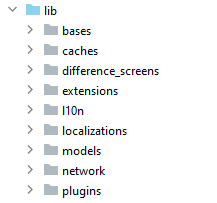
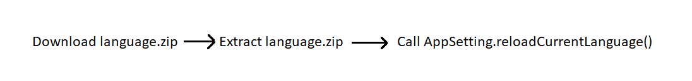
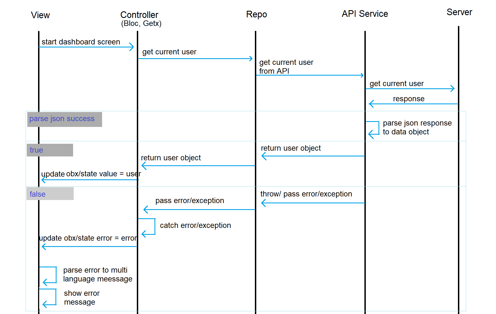
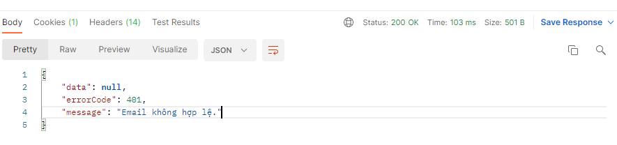
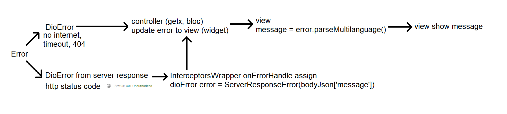
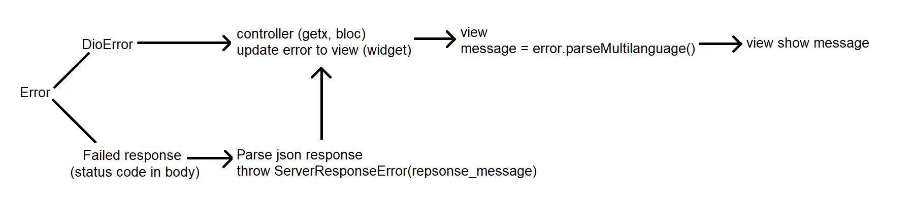
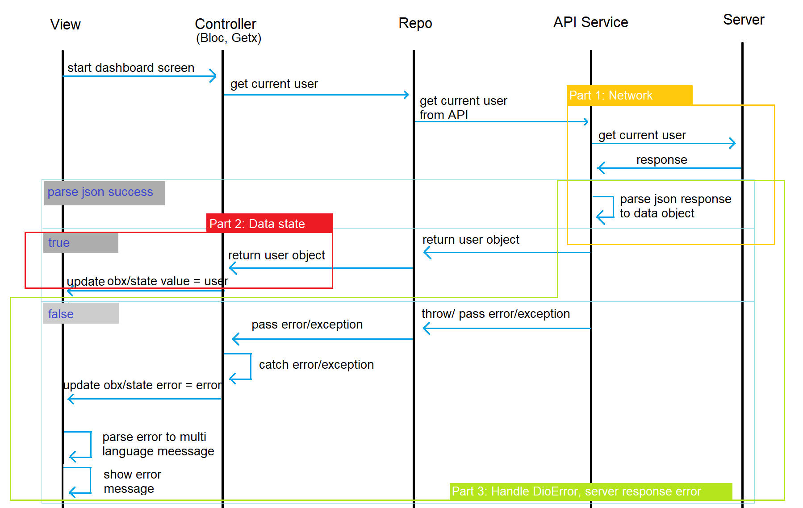

Flutter core library
-------
The purpose of this library is to speed up the creation of new mobile Application and support some features

Features:

* Internationalization
* Handle exception
* Handle different screens
* Handle call API (base on Dio)
* Cache user data
* Pluggable module

Requirement
-------

* Dart SDK >= 2.12.0
* Flutter >= 2.1
* IDE: Android Studio or Visual Code
  
  Knowledge:
* flutter_localizations
* dio, interceptors
* getx controller

Quick start
-------

* Add this script to pub.yaml file

```yaml
 flutter_core:
   git:
     url: https://github.com/vts-contributor/vts-kit-flutter-core.git
     ref: develop
```

* Run pub get in project

```shell script
cd <project>
flutter pub get
```

* Use library

Usage
-------

#### Code Structure

This Template Generated Code Structure base on MVC Pattern



#### Library references

This library base on
[flutter_localizations](https://docs.flutter.dev/development/accessibility-and-localization/internationalization)
, [shared_preferences](https://pub.dev/packages/shared_preferences)
, [local_auth](https://pub.dev/packages/local_auth)
, [rxdart](https://pub.dev/packages/rxdart)
, [dio](https://pub.dev/packages/dio) library

### Internationalization

#### Define constant localizations in project

By default, This Template built-in supported Internationalization with 2 language: English and
Vietnamese.\

* First, in `/lib` directory, create a folder named `l10n`, then define message on `messages_en.arb`
  and `messages_vi.arb` file.
  `messages_en.arb`

```arb
{
  "loginTxtUsername": "User name"
}
```

`messages_vi.arb`

```arb
{
  "loginTxtUsername": "Tên đăng nhập"
}
```

* Then, create `l10n.yaml` file in root.

```yaml
arb-dir: lib/l10n
template-arb-file: messages_en.arb
output-dir: lib/localizations/generated
output-localization-file: messages.dart
output-class: MessageLocalizations
synthetic-package: false
```

The `output-dir: lib/localizations/generated` move localizations class into `/lib`, you can commit
localization output files to git and you do not need to run `flutter gen_l10n` when open
project.<br>
The `synthetic-package: false` makes above worked.<br>

* Let's run `flutter gen_l10n` and use

```flutter
    return MaterialApp(
          title: 'Flutter Demo',
          theme: ThemeData(
            primarySwatch: Colors.red,
          ),
          localizationsDelegates: [
            MessageLocalizations.delegate,
            GlobalMaterialLocalizations.delegate,
            GlobalWidgetsLocalizations.delegate,
            GlobalCupertinoLocalizations.delegate,
          ],
          locale: locale,
          supportedLocales: SUPPORTED_LOCALES,
          home: Scaffold(
            appBar: FlattenAppBar(),
            body: ...,
          ),
        );
```

```flutter
    final appLocalizations = MessageLocalizations.of(context);
    return TextField(
      textInputAction: TextInputAction.next,
      decoration: InputDecoration(
      icon: Icon(Icons.account_circle),
      labelText: appLocalizations?.loginTxtUsername ?? ''),
      controller: userTextController,
)
```

Read fully
in [Internationalizing Flutter apps](https://docs.flutter.dev/development/accessibility-and-localization/internationalization)

#### Switch locale manually

By default, application language change when user change device language (locale). Flutter core
library support user change only app language.

* In main.dart, wrap `MaterialApp` by `StreamBuilder` with `AppSetting.languageStream` stream.

```dart
 @override
Widget build(BuildContext context) {
  return StreamBuilder(
    stream: AppSetting.languageStream,
    builder: (context, language) {
      Locale? locale = language.data as Locale?;
      return MaterialApp(
        title: 'Flutter Demo',
        theme: ThemeData(
          primarySwatch: Colors.red,
        ),
        localizationsDelegates: [
          CoreLocalizations.delegate,
          MessageLocalizations.delegate,
          ExternalLocalizations.delegate,
          GlobalMaterialLocalizations.delegate,
          GlobalWidgetsLocalizations.delegate,
          GlobalCupertinoLocalizations.delegate,
        ],
        locale: locale,
        supportedLocales: SUPPORTED_LOCALES,
        home: Scaffold(
          appBar: FlattenAppBar(),
          body: null,//something else,
        ),
      );
    },
  );
}
```

* Using:
* [AppSetting.setLanguage(new Language('vi','Tiếng Việt'))](lib/caches/settings.dart) to change
  language to Vietnamese though device uses English.
* [AppSetting.resetOSLanguage()](lib/caches/settings.dart) to reset to device language (locale).
* [AppSetting.reloadCurrentLanguage()](lib/caches/settings.dart) to rebuild application (
  MaterialApp) to receive external language (localization file download from server,...) (optional).

#### External localizations

Sometimes, labels, column names need to be changed without change code. You can download a text file
from server then use it with Flutter core.



* Must implement `Switch locale manually` app structure with `ExternalLocalizations.delegate`
  in `MaterialApp`

```dart
@override
Widget build(BuildContext context) {
  return StreamBuilder(
    stream: AppSetting.languageStream,
    builder: (context, language) {
      Locale? locale = language.data as Locale?;
      return MaterialApp(
        title: 'Flutter Demo',
        theme: ThemeData(
          primarySwatch: Colors.red,
        ),
        localizationsDelegates: [
          CoreLocalizations.delegate,
          MessageLocalizations.delegate,
          ExternalLocalizations.delegate,
          GlobalMaterialLocalizations.delegate,
          GlobalWidgetsLocalizations.delegate,
          GlobalCupertinoLocalizations.delegate,
        ],
        locale: locale,
        supportedLocales: SUPPORTED_LOCALES,
        home: Scaffold(
          appBar: FlattenAppBar(),
          body: null,//something else,
        ),
      );
    },
  );
}
```

* Write a download function like below and put it into load config progress in Splash screen or
  after login success.

```dart
CancelToken? _cancelDownloadLanguages;

void downloadLanguageFile() async {
  String savePath = await Storage.internalStoragePath;
  String url = 'http://***/languages.zip';
  if (_cancelDownloadLanguages?.isCancelled == false) {
    _cancelDownloadLanguages?.cancel('prevent duplicated request');
  }
  _cancelDownloadLanguages = CancelToken();
  Stream.fromFuture(download(
    url,
    '$savePath/languages.zip',
    cancelToken: _cancelDownloadLanguages,
    onReceiveProgress: (count, total) {

    },
  )).listen((file) async {
    await Storage.extractZipFile(file.path
        .split('/')
        .last);
    AppSetting.reloadCurrentLanguage(); //rebuild app to read external localizations
  }).onError((error) {
    print(error);
  });
}
```

* `language.zip` contain support language json file: `en.json` & `vi.json` (locale code)<br>
  
`en.json`

```json 
{
  "message": "message"
}
```

`vi.json`

```json 
{
  "message": "tin nhắn"
}
```

[language.zip](readme_files/languages.zip) sample

* Using

```flutter
final externalLocalizations = ExternalLocalizations.of(context);
externalLocalizations.getString('message');
```

### Handle exception

In Dart language, we have some issues with exception.

* Exception toString() always return `'Exception: $message'`

```dart
class Exception {
  String toString() {
    Object? message = this.message;
    if (message == null) return "Exception";
    return "Exception: $message";
  }
}
```

* Default exception provides message only in English, you can not show 'Not connection error' dialog
  to Vietnamese user
* If you `switch case` exception in every screen to get corresponding messages, you will have a lot
  of duplicate codes

=> Flutter core rewrites Exception to classify exceptions and override toString() to show
exactly `en` or `vi` messages to user  
Example:
You call `BiometricAuth.authenticate()` to authenticate by finger, faceID,... (`BiometricAuth`
wrap `LocalAuthentication` class). But user device do not have any biometric, `BiometricAuth` throw
a NotEnabledBioSecurityException. In screen widget, you just call exception.parseMultiLanguage(
context) to get localization messages.

See more, [MultiLanguageException](lib/extensions/exceptions.dart).

Sometime, IDE could not resolve `parseMultiLanguage` method, you can manually import 'package:
flutter_core/extensions/extensions.dart'

### Handle different screens


* Add 'with [AdaptivePage](lib/difference_screens/mixin_adaptive_page.dart)' into State of Widget

```dart
class _LoginScreenState extends State<LoginScreen> with AdaptivePage {

  @override
  Widget build(BuildContext context) {
    return Scaffold(
      body: adaptiveBody(context),
    );
  }

  @override
  Widget landscapeBody(BuildContext context, Size size) {
    //TODO
  }

  @override
  Widget portraitBody(BuildContext context, Size size) {
    //TODO
  }

  @override
  Widget tabletPortraitBody(BuildContext context, Size size) {
    //optional
    //TODO
  }

  @override
  Widget tabletLandscapeBody(BuildContext context, Size size) {
    //optional
    //TODO
  }
}
```

### Handle call API (base on Dio)

Here is a sequence diagram of action get data from API



#### Network

As usual, a API_Service class has HOST const, get/post data functions,... Now, add a json parser
function which parse dio Response to [JsonResponse](lib/network/response_json.dart) or its derived
class.

```dart
import 'package:flutter_core/network/network.dart' as network;

class ApiService {
  static final String host = 'http://***';

  static VCRMResponseJson jsonParser(Response response) =>
      VCRMResponseJson.fromDioResponse(response);

  Future<UserInfo> getCurrentUser({CancelToken? cancelToken}) async {
    final response = await network.get(
        host, 'current-user', cancelToken: cancelToken, interceptors, ApiService.jsonParser);
    return UserInfo.fromJson(response.content);
  }
}
```

Create a <application_name>ResponseJson extends JsonResponse to write a json parser.

Example:

```dart
class VCRMResponseJson extends JsonResponse {
  VCRMResponseJson({content, errorCode, errorMessage})
      : super(content: content, errorCode: errorCode, errorMessage: errorMessage);

  factory VCRMResponseJson.fromLoginResponse(Response response){
    VCRMResponseJson responseJson;
    final Map<String, dynamic> bodyJson = response.data;
    if (bodyJson.containsKey('data')) { //success
      responseJson = VCRMResponseJson(
          content: bodyJson['data'],
          errorCode: response.statusCode,
          errorMessage: response.statusMessage);
    } else { //failed
      String? errorCode, errorMessage;
      if (bodyJson.containsKey('error')) {
        final errorJson = bodyJson['error'];
        errorCode = errorJson['code'];
        errorMessage = errorJson['message'];
      }
      responseJson = VCRMResponseJson(
          content: bodyJson,
          errorCode: errorCode,
          errorMessage: errorMessage);
    }
    return responseJson;
  }
}
```

Create interceptors function to handle before & after request. More about [interceptor](https://pub.dev/packages/dio#interceptors)
```dart
InterceptorsWrapper get interceptors =>
        InterceptorsWrapper(onRequest: onRequestHandle, onError: onErrorHandle);

void onRequestHandle(RequestOptions options, RequestInterceptorHandler handler) {
  options.headers['authorization'] = '${Profile.token?.type} ${Profile.token?.access}';
  //TODO put content type or something else into request header
  handler.next(options);
}

void onErrorHandle(DioError error, ErrorInterceptorHandler handler) async {
  final response = error.response;
  //TODO handle refresh token (403), retry call API, get server error response message 
  handler.next(error);
}
```

#### Data state

In Controller layer, use GetxController.

Getx has `Rx` class which takes responsibility for updating data on view (like BlocState of Bloc).

```dart
class LoginGetx extends GetxController {
  final repo = Repository();
  final Rx<User> userObx = RxData<User>.init().obs;

  Future getCurrentUser(){
      final user = Repository().getCurrentUser();
      userObx.value = user;
  }
}

class _LoginScreenState extends State<LoginScreen> {

  late final LoginGetx _loginGetx;

  @override
  void initState() {
    super.initState();
    _loginGetx = Get.find(tag: LoginGetx.tag);
  }

  @override
  Widget build(BuildContext context) {
    return Scaffold(
      body: Obx(() {
        final userInfo = _loginGetx.userObx;
        //TODO show welcome user 
      }),
    );
  }
}
```
But, Rx can not tell whether data is loading or successful or failed or data is empty. And you should not declare state, error variables in every Model class. 

Read more [Getx state management](https://pub.dev/packages/get#state-management)

[RxData](lib/bases/rx_data.dart) is a choice. Let's change `userInfoObx` declaration:

```dart
class LoginGetx extends GetxController {
  final repo = Repository();
  //notice generic type
  final Rx<RxData<User>> userObx = RxData<User>.init().obs;

  Future getCurrentUser(){
    try {
      userObx.value = RxData.loading();
      final user = Repository().getCurrentUser();
      if (user != null) {
        userObx.value = RxData.success(user);
      } else {
        userObx.value = RxData.empty();
      }
    } catch (e){
      userObx.value =RxData.failed(e);
    }
  }
}

class _LoginScreenState extends State<LoginScreen> {

  late final LoginGetx _loginGetx;

  @override
  void initState() {
    super.initState();
    _loginGetx = Get.find(tag: LoginGetx.tag);
  }

  @override
  Widget build(BuildContext context) {
    return Scaffold(
      body: Obx(() {
        final userInfo = _loginGetx.userObx;
        switch (userInfo.status) {
          case Status.LOADING:
          //TODO notify loading user
          case Status.SUCCESS:
          //TODO show welcome user
          case Status.FAILED:
          //TODO notify error
          default:
            return Container();
        }
      }),
    );
  }
}
```

#### Handle DioError, server response error

* There 2 ways to return a status code in response:

* http status code<br>
  
* in response body<br>
  

* In the first case, both server response error & default exception (SocketException,
  TimeoutException,...) are DioError. <br>
  (Dio always throw a DioError when response http status code is not success.)<br>
  Just call dioError.parseMultiLanguage(context) to show error message to user.<br>
  <br>
  Example:

```dart
InterceptorsWrapper get interceptors =>
        InterceptorsWrapper(onRequest: onRequestHandle, onError: onErrorHandle);

void onErrorHandle(DioError dioError, ErrorInterceptorHandler handler) async {
  if (dioError.response == SUCCESS_200) {
    //TODO
  } else {
    final json = jsonDecode(error.response?.data);
    final errorMessage = json['message'];
    dioError.error = ServerResponseError(errorMessage);
  }
  handler.next(error);
}
```

```dart
class LoginGetx extends GetxController {
  Future requestLogin(String username, String password, {CancelToken? cancelToken}) async {
    try {
      userObx.value = RxData.loading();
      var token = await repo.requestLogin(username, password, cancelToken: cancelToken);
      userObx.value = RxData.succeed(token);
    } catch (e) { //server response error is here
      //pass error to view
      userObx.value = RxData.failed(e);
    }
  }
}
```

```dart
class _LoginScreenState extends State<LoginScreen> {

  late final LoginGetx _loginGetx;

  @override
  void initState() {
    super.initState();
    _loginGetx = Get.find(tag: LoginGetx.tag);
  }

  @override
  Widget build(BuildContext context) {
    return Scaffold(
      body: Obx(() {
        final userInfo = _loginGetx.userObx;
        switch (userInfo.status) {
          case Status.LOADING:
          //TODO notify loading user
          case Status.SUCCESS:
          //TODO show welcome user
          case Status.FAILED:
            final errorMessage = userInfo.error.parseMultiLanguage(context);
          //TODO notify error
          default:
            return Container();
        }
      }),
    );
  }
}
```


* In the remaining case, server response error inside response, it is not thrown as Exception and
  can not call .parseMultiLanguage(). So have to throw a Exception when receive a server response
  error in parse json function.<br>
  <br>
  
  Example:
```dart
class VCRMResponseJson extends JsonResponse {
  factory JsonResponse.fromDioResponse(Response response) {
    JsonResponse responseJson;
    final Map<String, dynamic> bodyJson = response.data;
    final resultJson = bodyJson['data'];
    final statusCode = bodyJson['errorCode'];
    final String errorMessage = bodyJson['message'];
    if (statusCode == SUCCESS_200) {
      responseJson = JsonResponse(
              content: bodyJson,
              errorCode: response.statusCode,
              errorMessage: errorMessage);
    } else {
      throw ServerResponseError(errorMessage); //this line
    }
    return responseJson;
  }
}
```

```dart
//LoginGetx
Future requestLogin(String username, String password, {CancelToken? cancelToken}) async {
  try {
    userObx.value = RxData.loading();
    var token = await repo.requestLogin(username, password, cancelToken: cancelToken);
    userObx.value = RxData.succeed(token);
  } catch (e) { //server response error is here
    //pass error to view
    userObx.value = RxData.failed(e);
  }
}
```

```dart
class _LoginScreenState extends State<LoginScreen> {

  late final LoginGetx _loginGetx;

  @override
  void initState() {
    super.initState();
    _loginGetx = Get.find(tag: LoginGetx.tag);
  }

  @override
  Widget build(BuildContext context) {
    return Scaffold(
      body: Obx(() {
        final userInfo = _loginGetx.userObx;
        switch (userInfo.status) {
          case Status.LOADING:
          //TODO notify loading user
          case Status.SUCCESS:
          //TODO show welcome user
          case Status.FAILED:
            final errorMessage = userInfo.error.parseMultiLanguage(context);
          //TODO notify error
          default:
            return Container();
        }
      }),
    );
  }
}
```

Explanation for the use of ServerResponseError class, it allow to show server response error message to user. See more [MultiLanguageException](lib/extensions/exceptions.dart)

#### Recap, the range of components above corresponds to the visual description below.



#### Validation Extensions
For easier validation, some extension methods is provided for dart's data types.

##### Object
| Method | Parameter | Usage |
|--------|------------|-------|
|  isNull      |            | validate null object     |
| isNotNull| | validate if this object is not null |
| isIn | - values: dynamic | validate if this object exists in a collection (Map, List, Set...) |
| isInMap | - map: Map<dynamic, dynamic> | validate if this object exists in map
| isInIterable | - iterable: Iterable<dynamic> | validate if this object exists in List, Set, LinkedHashSet...  |
##### bool
no specific methods yet.
##### num
| Method | Parameter | Usage |
|--------|------------|-------|
|   isInRange    |   - lower: num (lower bound)  <br> - upper: num (upper bound) <br> named: <br> - lowerBoundExclusive: bool (means lower bound is'[' or '(')  <br> - upperBoundExclusive: bool (means upper bound is']' or ')')  | validate if this number is in range  |
##### int
all num's methods.
| Method | Parameter | Usage |
|--------|------------|-------|
|   isPrime    |      |  validate if this int is a prime number   |
##### double
all num methods.
##### String
| Method | Parameter | Usage |
|--------|------------|-------|
|   matches    |- pattern: String (regex pattern) <br> optional <br> - caseSensitive: bool <br> - multiLine: bool <br> - unicode: bool <br> - dotAll: bool     | validate string matches a regex pattern       |
| isInt | | validate string is an integer (can be parsed to int) |
| isDouble | | validate string is a double (can be parsed to double) |
| isNumeric | | validate string is numeric (can be parsed to num)|
| isLowerCase | | validate string is in lowercase |
| isUpperCase | | validate string is in uppercase|
| isDateTime | | validate string is a date (String can be parsed using DateTime.parse(), for other format, use isDateTimeByFormat)|
| isDateTimeByFormat | - format: DateFormat | validate string is a date with custom defined format |
| isAlphabet | named: <br> - acceptWhiteSpace: bool <br> - unicode: bool (turn this on for unicode string) | validate string contains only letters |
| isAlphabetNumeric | named: <br> - acceptWhiteSpace: bool <br> - unicode: bool (turn this on for unicode string) | validate string contains only letters and numbers |
| isURL | named: <br> - protocols: List<String> - <br> - requireProtocol: bool <br> | validate string is URL
| isCamelCase |  | validate string is camel case |
| isHexColor | | validate string is hexadecimal color |
| isARGBHexColor | | validate string is hexadecimal color with transparency |
| isJson | | validate string is a a json (parsable by jsonDecode) |
| isIPv4 | | validate string is IPv4 |
| isIPv6 | | validate string is IPv6 |
| isIP | | validate string is an IP |
| isUUID | | validate string is UUID |
| isVND | named: <br> - delimeters: List<String> <br> - ending: List<String> | validate string has VND format |
##### DateTime
| Method | Parameter | Usage |
|--------|------------|-------|
| equalsDate       |- other: DateTime            | validate this date equals other date base on day, month, year   |
| equals | -other: DateTime <br> named: <br> - year: bool <br> - month: bool <br> - day: bool <br> - hour: bool <br> - minute: bool <br> - second: bool <br> - millisecond: bool <br> - microsecond: bool | validate this date equals other date base on whichever flags are turned on |
|isInDurationApartFrom| - date: DateTime <br> - duration: Duration <br> optional: <br> - lowerBoundExclusive: bool <br> - upperBoundExclusive: bool | validate this date is in range [other date - duration, other date + duration] |
| isInDurationAfter | - date: DateTime <br> - duration: Duration <br> optional: <br> - exclusive: bool | validate this is in [duration] from other date. <br> ex: ``` isInDurationAfter(DateTime.now(), Duration(minute: 30)) ```=> validate this is in 30 minutes from now |
| isInDurationBefore | - date: DateTime <br> - duration: Duration <br> optional: <br> - exclusive: bool | validate this isn't over [duration] ago from other date. <br> ex: ``` isInDurationBefore(DateTime.now(), Duration(minute: 30)) ```=>validate if this isn't over 30 minutes ago |
| isInRange | - date1: DateTime <br> - date2: DateTime <br> optional: <br> - lowerBoundExclusive: bool <br> - upperBoundExclusive: bool | validate date is in range [date1, date2] or [date2, date1]
| isBeforeInclusive | - date: DateTime | is before or at the same moment|
| isAfterInclusive | - date: DateTime | is after or at the same moment |
##### TimeOfDay
| Method | Parameter | Usage |
|--------|------------|-------|
| equals  | - other: TimeOfDay <br> named: <br> - hour: bool <br> minutes: bool     |  compare two TimeOfDay base on flags |
| isDay |  | validate TimeOfDay period is AM |
| isNight | | validate TimeOfDay period is PM |

##### Iterable
| Method | Parameter | Usage |
|--------|------------|-------|
| validateAll   |   - test: bool Function(element: T) <br> optional: <br> - errorValues: List<T>? | validate elements all pass the test function and pick out error values.

##### List
| Method | Parameter | Usage |
|--------|------------|-------|
| validateAll   |   - test: bool Function(element: T) <br> optional: <br> - errorValues: List<T>? <br> - errorIndexes: List<int>?       | validate elements all pass the test function and pick out error values and indexes.

##### Map
| Method | Parameter | Usage |
|--------|------------|-------|
| validateAll   |   - test: bool Function(element: V) <br> optional: <br> - errorValues: List<V>?  <br> - errorKeys: List<K>? | validate elements all pass the test function and pick out error values and keys. |
| containsPair | - key: K <br> - value: V | validate this map contains pair of [key] and [value].

License
-------
This code is under the [MIT License](https://opensource.org/licenses/MIT).

See the [LICENSE](LICENSE) file for required notices and attributions.